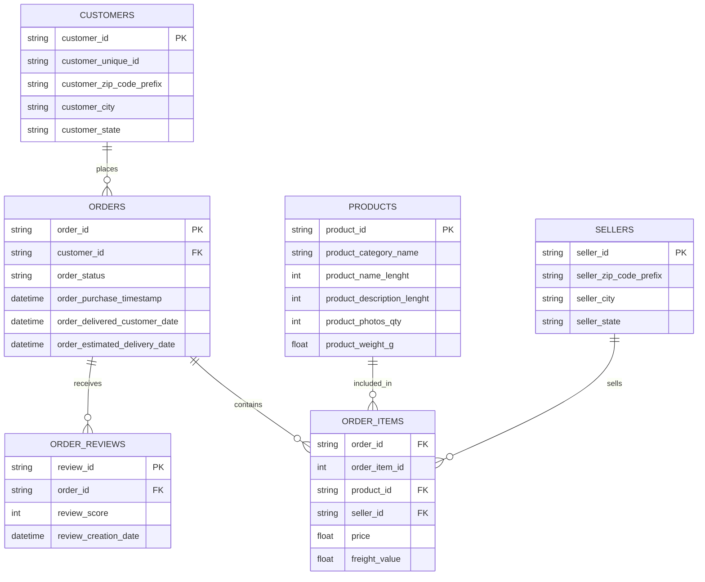

# Olist Ecommerce Analytics

## Project Overview

This project demonstrates an end-to-end E-commerce Analytics workflow using the Olist Brazilian E-Commerce Dataset.

## Objectives

- Data Cleaning
- ETL Pipeline Development
- SQL Analytics
- Data Warehouse Design
- Power BI Dashboard

## Tech Stack

- Python
- Pandas
- PostgreSQL / MySQL
- SQL
- Power BI
- Git & GitHub

## Dataset

Olist Brazilian E-Commerce Dataset

## Project Structure

data/
etl/
sql/
dashboard/
notebooks/

## Status

🚧 In Progress

## Entity Relationship Diagram

## Data Quality Assessment
         table    rows  columns  missing_values  duplicates
0    customers   99441        5               0           0
1       orders   99441        8            4908           0
2  order_items  112650        7               0           0
3     products   32951        9            2448           0
4      sellers    3095        4               0           0
5      reviews   99224        7          145903           0