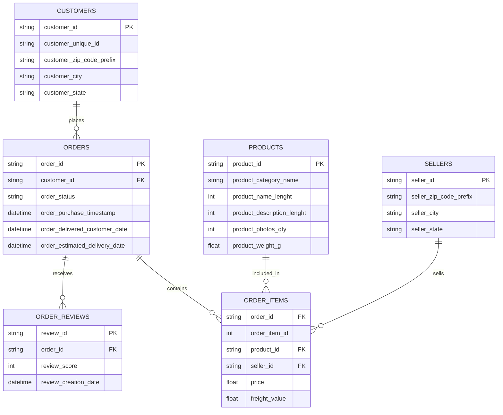
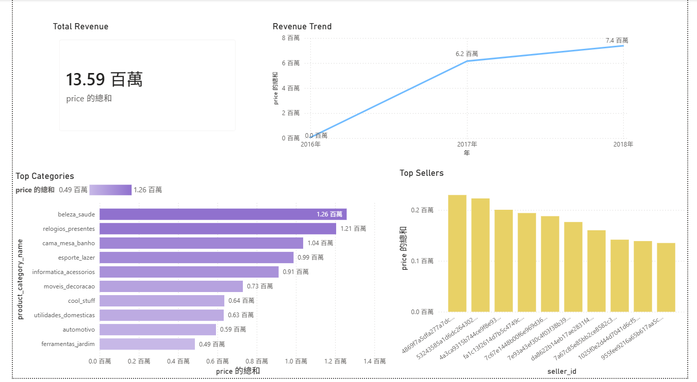

# Olist Ecommerce Analytics

## Project Overview

This project demonstrates an end-to-end E-commerce Analytics workflow using the Olist Brazilian E-Commerce Dataset.

## Objectives

- Data Cleaning
- ETL Pipeline Development
- SQL Analytics
- Data Warehouse Design
- Power BI Dashboard

## Tech Stack

- Python
- Pandas
- PostgreSQL / MySQL
- SQL
- Power BI
- Git & GitHub

## Dataset

Olist Brazilian E-Commerce Dataset

## Project Structure

data/
etl/
sql/
dashboard/
notebooks/

## Status

🚧 In Progress

## Entity Relationship Diagram

```mermaid
erDiagram
    CUSTOMERS ||--o{ ORDERS : places
    ORDERS ||--o{ ORDER_ITEMS : contains
    ORDERS ||--o{ ORDER_REVIEWS : receives
    PRODUCTS ||--o{ ORDER_ITEMS : included_in
    SELLERS ||--o{ ORDER_ITEMS : sells

    CUSTOMERS {
        string customer_id PK
        string customer_unique_id
        string customer_zip_code_prefix
        string customer_city
        string customer_state
    }

    ORDERS {
        string order_id PK
        string customer_id FK
        string order_status
        datetime order_purchase_timestamp
        datetime order_delivered_customer_date
        datetime order_estimated_delivery_date
    }

    ORDER_ITEMS {
        string order_id FK
        int order_item_id
        string product_id FK
        string seller_id FK
        float price
        float freight_value
    }

    PRODUCTS {
        string product_id PK
        string product_category_name
        int product_name_lenght
        int product_description_lenght
        int product_photos_qty
        float product_weight_g
    }

    SELLERS {
        string seller_id PK
        string seller_zip_code_prefix
        string seller_city
        string seller_state
    }

    ORDER_REVIEWS {
        string review_id PK
        string order_id FK
        int review_score
        datetime review_creation_date
    }
```
## Data Quality Assessment
         table    rows  columns  missing_values  duplicates
0    customers   99441        5               0           0
1       orders   99441        8            4908           0
2  order_items  112650        7               0           0
3     products   32951        9            2448           0
4      sellers    3095        4               0           0
5      reviews   99224        7          145903           0

## Business Analysis

### Top Product Categories by Revenue

     product_category_name       price
12            beleza_saude  1258681.34
67      relogios_presentes  1205005.68
14         cama_mesa_banho  1036988.68
33           esporte_lazer   988048.97
45  informatica_acessorios   911954.32
55        moveis_decoracao   729762.49
27              cool_stuff   635290.85
73   utilidades_domesticas   632248.66
9               automotivo   592720.11
41      ferramentas_jardim   485256.46

### Key Findings

- Top 10 categories contribute X% of total revenue
- Category A generates the highest revenue
- Category B shows strong order volume

## Key Findings

### Revenue Analysis

Top 5 Product Categories

1. Beauty & Health
2. Watches & Gifts
3. Bed, Bath & Table
4. Sports & Leisure
5. IT Accessories

These categories contribute a significant portion of platform revenue.

## Key Findings

### Revenue Trend

- Revenue grew significantly throughout 2017.
- Peak revenue occurred in November 2017.
- Likely driven by Black Friday promotions.

### Product Categories

Top revenue categories:

1. Beauty & Health
2. Watches & Gifts
3. Bed, Bath & Table

### Data Quality

- Orders: 4,908 missing values
- Products: 610 missing category records
- Reviews: 145,903 missing comment-related fields

## Dashboard

### Executive Overview

Key Metrics:
- Total Revenue
- Revenue Trend
- Top Product Categories
- Top Seller