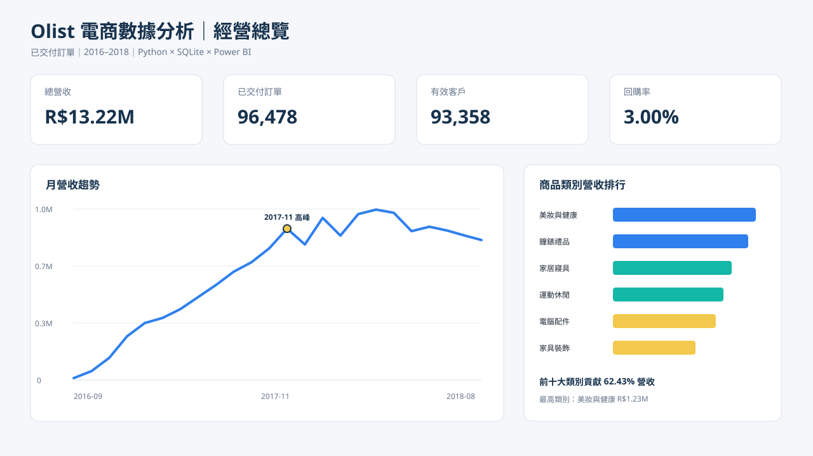
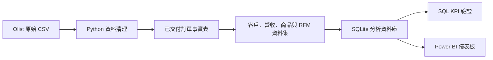
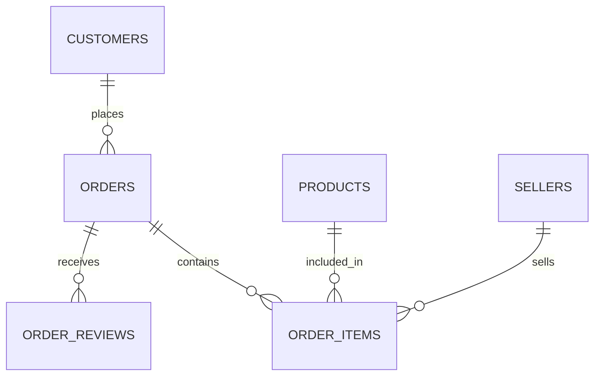

# Olist 電商數據分析｜Python × SQLite × Power BI

以 Olist Brazilian E-Commerce Dataset 建立的端到端數據分析專案。專案涵蓋資料品質檢查、ETL、SQLite 分析資料庫、營收與賣家績效、客戶回購、RFM 分群，以及四頁 Power BI 商業儀表板。



## 專案目標

- 建立可重複執行的資料清理與 ETL 流程。
- 統一營收口徑，只計算已完成交付（`delivered`）的訂單。
- 分析營收趨勢、商品類別與賣家績效。
- 衡量回購行為，並利用 RFM 模型進行客戶分群。
- 將分析結果轉換為可執行的留存與營運建議。

## 核心 KPI

| 指標 | 結果 | 定義 |
|---|---:|---|
| 總營收 | R$13,221,498.11 | 已交付訂單的商品金額 |
| 已交付訂單 | 96,478 | 不重複 `order_id` |
| 有效客戶 | 93,358 | 至少完成一筆交付訂單的 `customer_unique_id` |
| 活躍賣家 | 2,970 | 已交付訂單中的不重複賣家 |
| 商品類別 | 74 | 含 `Unknown` 類別 |
| 平均訂單金額 | R$137.04 | 總營收 ÷ 已交付訂單數 |
| 平均商品價格 | R$119.98 | 總營收 ÷ 商品明細數 |
| 回購率 | 3.00% | 購買兩次以上客戶 ÷ 有效客戶 |

## 主要發現

1. **營收高峰出現在 2017 年 11 月**，當月營收為 R$987,765.37，與年底促銷及 Black Friday 檔期相符。
2. **美妝與健康是營收最高的商品類別**，貢獻 R$1,233,131.72，占總營收 9.33%。
3. **前十大商品類別貢獻 62.43% 營收**，顯示平台營收集中於少數核心品類。
4. **回購率僅 3.00%**，93,358 位有效客戶中只有 2,801 位完成第二次以上購買。
5. **沉睡客群占 22.82% 客戶、貢獻 35.01% 營收**，是優先執行喚回行銷的客群。
6. **賣家營收呈現長尾分布**，最高營收賣家占平台總營收約 1.72%。

## 商業建議

- 對高消費但長時間未購買的沉睡客群，設計限時回購優惠與個人化再行銷。
- 在首次購買後 30–60 天設置第二次購買誘因，提高目前偏低的回購率。
- 優先配置美妝健康、鐘錶禮品、家居寢具等核心類別的行銷與供應資源。
- 維繫高績效賣家，同時建立中段賣家成長方案，降低營收過度集中風險。
- 將 11 月高峰拆解為促銷前、促銷期與促銷後三階段，建立年度活動基準。

## Power BI 儀表板

儀表板包含四個中文頁面：

1. **經營總覽**：總營收、月營收趨勢、商品類別與賣家排行。
2. **客戶與 RFM 分群**：客戶 KPI、客群規模、營收貢獻與行銷洞察。
3. **商品與賣家績效**：商品類別、賣家、平均訂單金額與營收趨勢。
4. **商品類別明細**：類別 Drill-through、賣家排行與訂單明細。

正式報表位於 [`dashboard/customer_analytics.pbix`](dashboard/customer_analytics.pbix)，無內嵌資料的可重用範本位於 [`dashboard/customer_analytics.pbit`](dashboard/customer_analytics.pbit)。

## 分析流程


```mermaid
flowchart LR
    A[Olist 原始 CSV] --> B[Python 資料清理]
    B --> C[已交付訂單事實表]
    C --> D[客戶、營收、商品與 RFM 資料集]
    D --> E[SQLite 分析資料庫]
    E --> F[SQL KPI 驗證]
    E --> G[Power BI 儀表板]
```

## 資料模型


```mermaid
erDiagram
    CUSTOMERS ||--o{ ORDERS : places
    ORDERS ||--o{ ORDER_ITEMS : contains
    ORDERS ||--o{ ORDER_REVIEWS : receives
    PRODUCTS ||--o{ ORDER_ITEMS : included_in
    SELLERS ||--o{ ORDER_ITEMS : sells
```

Power BI 主要使用下列分析表：

- `fact_orders`：已交付訂單的商品層級事實表。
- `customer_summary`：一客一列的客戶購買摘要。
- `monthly_revenue`：月營收趨勢。
- `top_categories`、`top_sellers`：商品類別與賣家績效。
- `rfm_segments`、`rfm_summary`：客戶層級 RFM 與分群摘要。

## 技術工具

- Python 3.11+
- pandas
- SQLite / SQL
- Power BI Desktop
- DAX / Power Query
- Git / GitHub

## 專案結構

```text
Olist-Ecommerce-Analytics/
├── data/
│   ├── raw/                 # Olist 原始資料
│   └── processed/           # ETL 與分析輸出
├── dashboard/               # Power BI PBIX / PBIT
├── database/                # 本機 SQLite（不提交 Git）
├── etl/                     # ETL、資料庫載入與驗證
├── images/                  # GitHub 視覺預覽
├── notebooks/               # EDA、營收、客戶與 RFM 分析
├── sql/                     # KPI 與商業分析查詢
├── README.md
└── requirements.txt
```

## 如何重現

### 1. 安裝環境

```bash
python -m venv .venv
.venv\Scripts\activate
pip install -r requirements.txt
```

### 2. 放置資料

將 Olist CSV 放入 `data/raw/`。本專案使用 [Brazilian E-Commerce Public Dataset by Olist](https://www.kaggle.com/datasets/olistbr/brazilian-ecommerce)。

### 3. 執行完整 ETL

```bash
python etl/etl.py
```

流程會依序建立 processed CSV，並將最新結果同步至 `database/olist.db`。

### 4. 驗證結果

```bash
python etl/validate_outputs.py
```

### 5. 開啟 Power BI

建立名為 `Olist_SQLite` 的 SQLite ODBC DSN，資料庫指向 `database/olist.db`，接著開啟 PBIX 並重新整理。

## 資料品質與限制

- 營收僅計算 `delivered` 訂單，不包含取消、不可用或仍在處理中的訂單。
- Olist 資料期間主要為 2016 年末至 2018 年，不能代表目前市場狀況。
- 商品分類保留葡萄牙文原始值；缺失分類以 `Unknown` 表示。
- 資料集沒有商品成本，因此本專案分析的是營收而非毛利。
- RFM 分群是基於資料集內的最後購買日，不代表即時客戶狀態。

## 授權與資料來源

本 repository 的程式碼採用 [MIT License](LICENSE)。Olist 原始資料的所有權與授權依原始資料發布頁面為準；資料不包含於 MIT 程式碼授權範圍。
